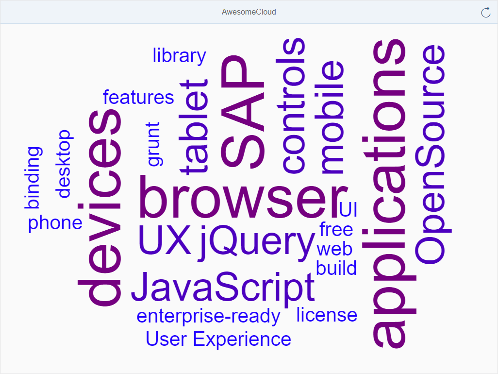

# Awesome Cloud
## [OpenUI5 Developer Blog](http://openui5.blogspot.com/2016/11/awesome-cloud.html)

> UI5 demo using a custom viewer control to generate a word cloud.
> 
> Based on [awesomeCloud - jQuery Plugin](https://github.com/metaloha/jQuery.awesomeCloud.plugin) jquery plugin.

### [Online Demo (SAP HCP)](https://awesomecloud-p1940953245trial.dispatcher.hanatrial.ondemand.com/index.html)

### Highlights

> - jquery word cloud
> - custom control interfacing jquery awesomeCloud library
> - JSOM model driven cloud words